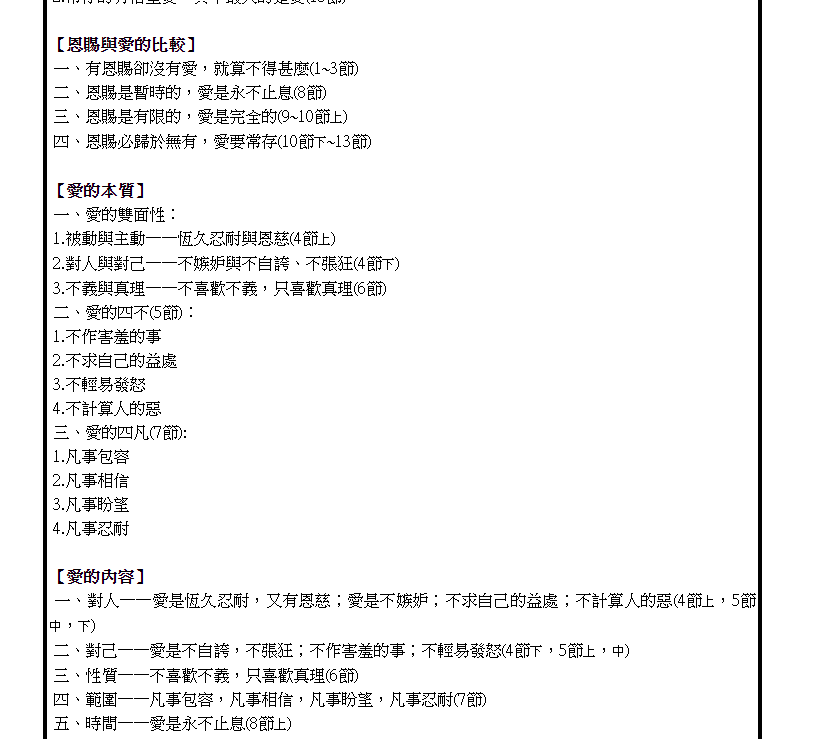
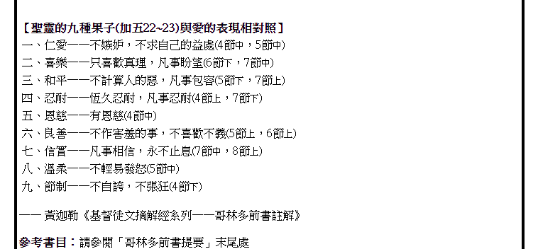

---  
share: true  
---  
  
  
https://www.ccbiblestudy.org/New%20Testament/46%201Cor/46CT13.htm  
  
愛是恆久忍耐，这是梅根说的，出自《林前13:4》。其实这里讲的是耶稣的爱。  
  
『愛是恆久忍耐，』神的愛與人的愛斷然不同。人的愛是短暫的，有條件的，就是最高的父母之愛，仍然會因某種情形而改變；但神的愛卻是恆久忍耐，祂愛我們到底，永不改變。  
  
耶稣的爱是比较高尚的。  
  
  
  
